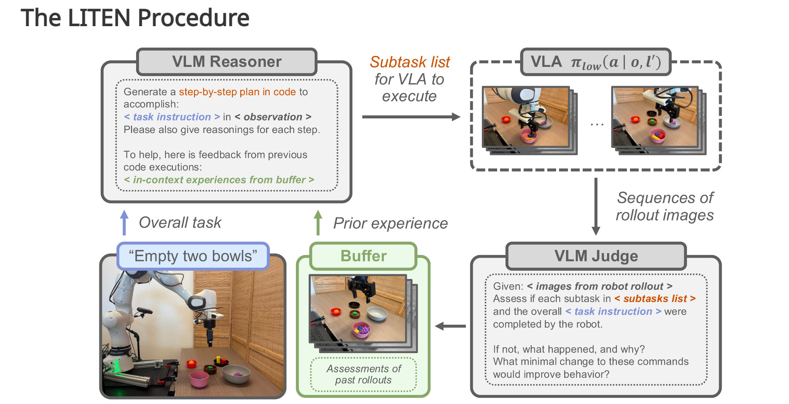
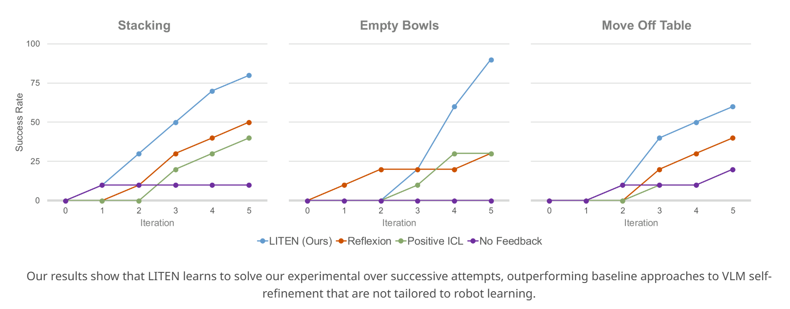
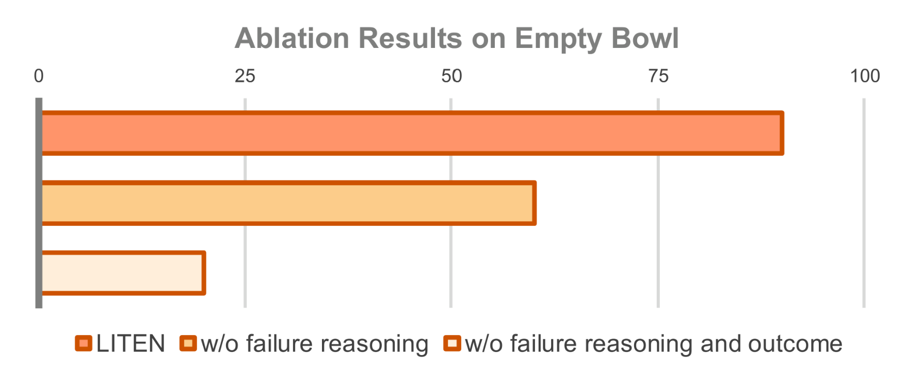

# Affordance


## Why Affordance?
Affordance defines what actions are possible on an object under a specific context.

e.g.
- A soft food item affords scooping but not stabbing
- A button affords pushing
- A handle affords grasping


## SAVOR: Skill Affordance Learning from Visuo‑Haptic Perception for Robot‑Assisted Bite Acquisition
> https://arxiv.org/abs/2506.02353v2

> https://emprise.cs.cornell.edu/savor/

combines tool affordances and food affordances to select the appropriate manipulation skill for robust bite acquisition.

### Motivation

## UAD: Unsupervised Affordance Distillation for Generalization in Robotic Manipulation

> https://arxiv.org/abs/2506.09284

> https://unsup-affordance.github.io/

能否利用这些模型中的“隐含”affordance知识，自动获取数据，进而训练一个专门的「任务条件化可供性（task-conditioned affordance）模型」并用于机器人操作。

使用 DINOv2 + 多视角融合 → 在 3D 点云中聚类 → 得到物体的语义区域簇


## Learning Affordances at inference time
> https://arxiv.org/abs/2510.19752

> https://liten-vla.github.io/

### Motivation

VLAs hold great promise for solving open-world robotics tasks, but are still quite limited when it comes to solving complex, long-horizon tasks.

Two key limitations to current VLAs are that 

1. they struggle to understand and perform multi-step instructions,

2. they are "single-shot": VLAs won't adjust their behavior and re-try a task, or learn from previous attempts.

### Basic Introduction

To deal with:

plan through complex behaviors

adjust its behavior based on context and perceived capabilities

- VLA as a low-level controller 

- A high-level VLM 
    - A "planner"——break down a complex task into a sequence of simpler instructions
    - provides a novel means of including **past experiences** in-context for the VLM

While hierarchical [17], [18] and reasoning [19], [20], [21], [22] approaches alleviate this, such methods require expensive data collection, annotation, and training. In contrast, LITEN uses an off-the-shelf VLM to learn from inference-time rollouts by storing and reasoning about them in-context, without training.

### Related fields

1. vla
VLA 主要是在“低层示教数据”上训练的 导致它不会高层推理
现有方法想解决这个问题，但：

分层策略 / 高层推理方法都依赖大量机器人数据

注释和训练成本极高

推理能力仍然受限
现有方法是什么？

2. Saycan
强大基础模型（LLM / VLM）可作为 高层规划器，与低层控制器配合使用。
高层 LLM 决定机器人应该做什么（任务分解）。
（2）低层策略 决定机器人能否做到（可供性 / affordances）。

典型代表：

SayCan：LLM 做任务规划，value function 做可供性评分

其他方法用离线 RL 或视觉启发式来估计 affordance

VoxPoser 将 LM 的推理转成可执行的 3D voxel 空间

有些方法直接用 VLM 做“场景解释 + 行为决策”一体化

问题在于：

这些方法都是 “Zero-shot”

→ 没有机器人数据的训练
→ VLM 不理解真实机器人能做什么、不能做什么
→ 导致计划很好看，但执行不了

随着任务变复杂，这个问题会更加严重。

3. 其它领域里的“推理时学习”（Inference-time Learning）

在非机器人领域（如游戏智能体、文本代理）中：

有许多迭代式、反思式的推理时改进方法（例如 Reflexion）。

它们通常依赖：

强大的规划器

高精度、高分辨率的模拟器状态

把状态、技能、反馈直接转成自然语言

这些前提在真实机器人上都不成立：

没有精准的 simulator state

没有完美的 ground-truth 反馈

低层控制器不完美、带噪声、无法严格复现

真实机器人执行成本高，不能无穷试错

因此直接把 Reflexion 之类的方法迁移到机器人上，效果不佳。



### initial reasoning phase
“guess” a plan (i.e., a sequence of subtask instructions)

### assessment
the outcomes of robot rollouts by determining which subtask commands failed, what the policy did incorrectly, possible reasons why, and how these errors might be avoided.

#### planner prompt 
generate $S={s1,s2,...,sk}$

Low-level-VLA(pi-droid)

#### judge prompt
输入子任务指令 + 开始图像 +结束图像 → 输出结构化评估：
  ```json
  {
    "success": true/false,
    "what_happened": "...",
    "failure_reason": "...",
    "improvements": [...]
  }
  ```

  memory

prompts 见 https://github.com/ameesh-shah/liten-vla/tree/main/vlm_hl/prompts


### Experiments
RQ.1. Can LITEN learn task-relevant affordances in its envi
ronment by interacting with the physical world?

RQ.2. As it gains experience, does LITEN effectively learn
 from both successes and failures, and iteratively im
prove its plans for complex tasks?

RQ.3. What is the importance of each step in the assessment
 phase of LITEN in facilitating learning from past
 experiences?


### Results

- Stacking

- Emptying Bowls

- Moving Off Table



 prior VLA
 methods do not utilize inference-time experience in-context
 we adapt Reflexion [8], an inference-time learning technique
 for agentic LLMs, to a robotic setting. Our adaptation

  ‘reflects’ on unstructured videos of executed plans, and uses
 these reflections in-context for subsequent iterations. This
 baseline can be thought of as a na¨ ıve adaptation of standard
 self-refinement approaches to real-world robotics. We also
 compare against an approach that only stores successful
 subtask attempts and provides those successful attempts
 in-context for future plan generations, called Positive-ICL.
 This approach mirrors existing methods that use positive in
context examples for zero-shot open-world robotic manipu
lation [29], and can be viewed as an ablation of our method
 that does not use negative examples. Lastly, we compare
 against a na¨ ıve baseline that regenerates a new plan at every
 iteration without using any feedback, called No-Feedback.

### Ablation Results




## RoboPoint: A Vision-Language Model for Spatial Affordance Prediction for Robotics
> https://arxiv.org/abs/2406.10721

> https://robo-point.github.io/


> https://arxiv.org/pdf/2511.10110
